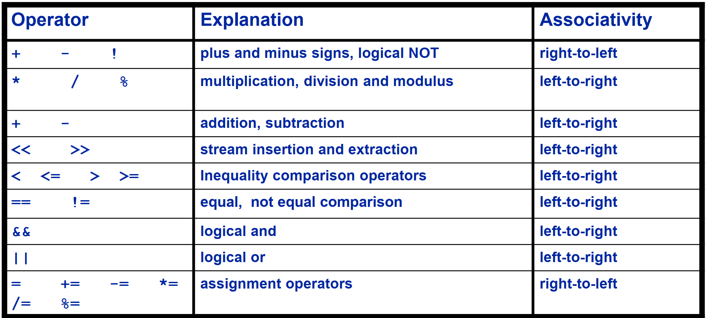

# Lecture 4

## Agenda
- if statement
  - nested if
  - compound conditions: &&, ||, !
    - short-circuting
  - precedence table 
- switch statement
- conditional operator ?
- iteration
  - for loop
  
---
